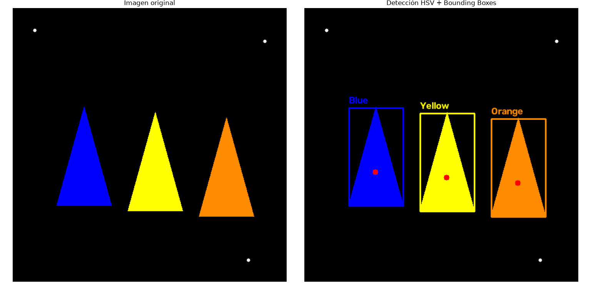
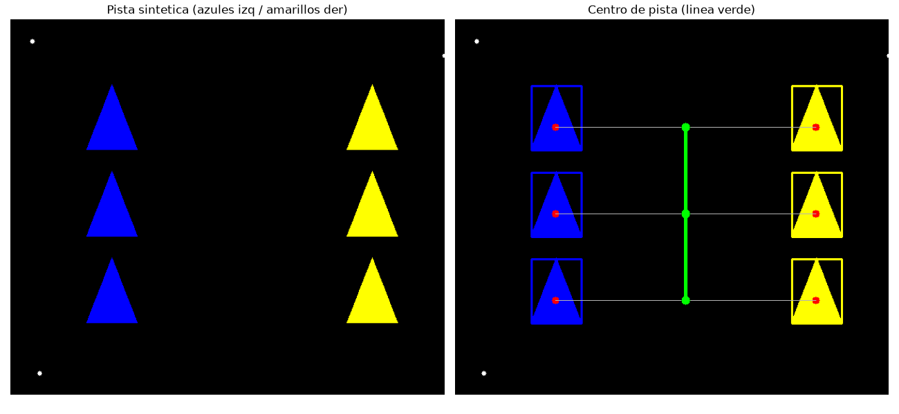
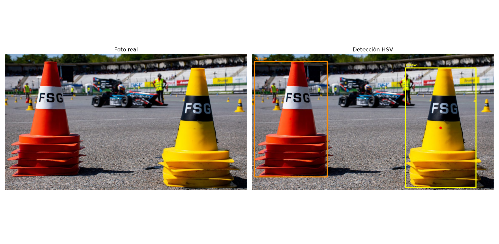

# FS Cone Perception Basics
Proyecto básico de detección de conos para Formula Student Driverless usando OpenCV.
## Descripción
Este repositorio contiene un pipeline sencillo de percepción que permite:

- Detectar formas que simulan conos en una imagen sintética
- Calcular el centroide de cada cono
- Generar Bounding Boxes 
- Filtrar ruido mediante operaciones morfológicas
- Clasificar conos por color en espacio HSV (azul, amarillo y naranja)
- Emparejar conos izquierdos y derechos para estimar el centro de la pista
- Detectar conos naranjas y amarillos en una foto real de competición

El objetivo es construir una base sólida de visión por computador orientada a la detección de conos, que es uno de los primeros pasos en el stack de Autonomous de Formula Student.
## Archivos
- `cone_detection_basic.py` — detección por umbral, morfología, contornos y bounding boxes
- `cone_detection_hsv.py` — detección y etiquetado por color (HSV)
- `cone_track_centerline.py` — pares azul/amarillo y línea central de pista
- `cone_detection_real.py` — detección HSV sobre una foto real de pista
## Librerías utilizadas
- Python
- OpenCV
- NumPy
- Matplotlib
## Cómo ejecutarlo
1. Clonar el repositorio
2. Instalar las dependencias:
```bash
pip install -r requirements.txt
```
3. Ejecutar el script básico:
```bash
python cone_detection_basic.py
```
4. Ejecutar el script HSV:
```bash
python cone_detection_hsv.py
```
5. Ejecutar el script de centro de pista:
```bash
python cone_track_centerline.py
```
6. Ejecutar el script con foto real (ejecutar desde la raíz del repo):
```bash
python cone_detection_real.py
```
## Resultados





## Estado actual
- [x] Creación de imagen sintética con conos
- [x] Preprocesamiento (threshold + morfología)
- [x] Detección de contornos
- [x] Cálculo de centroides
- [x] Bounding Boxes (recto y orientado)
- [x] Clasificacion por color HSV en imagen sintética (azul/amarillo/naranja)
- [x] Estimación del centro de pista a partir de pares azul / amarillo
- [x] Detección por color (HSV) en imágenes reales
- [ ] Integración con ROS2
## Próximos pasos
- Ajustar rangos HSV a iluminación de pista
- Agrupar mejor las cajas partidas por franjas del cono
- Empezar a estructurar el código como nodos de ROS2
---
Desarrollado como parte de mi preparación para entrar en el área de Autonomous de UVigo Motorsport.
