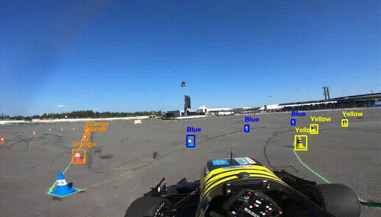
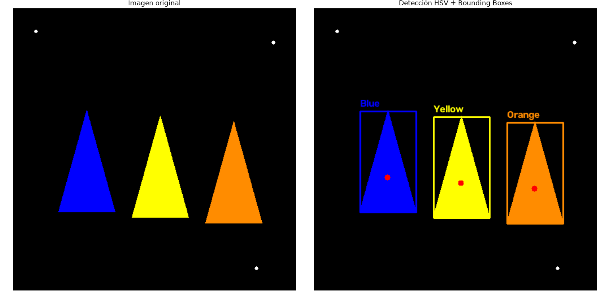
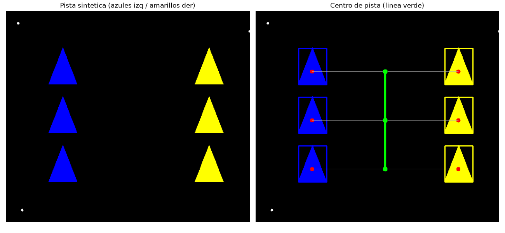
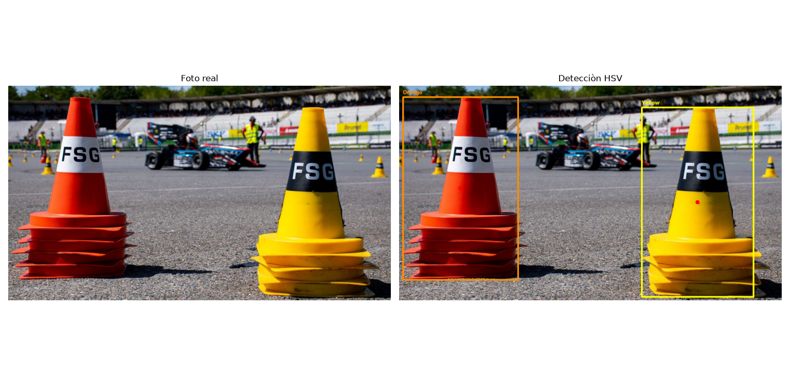
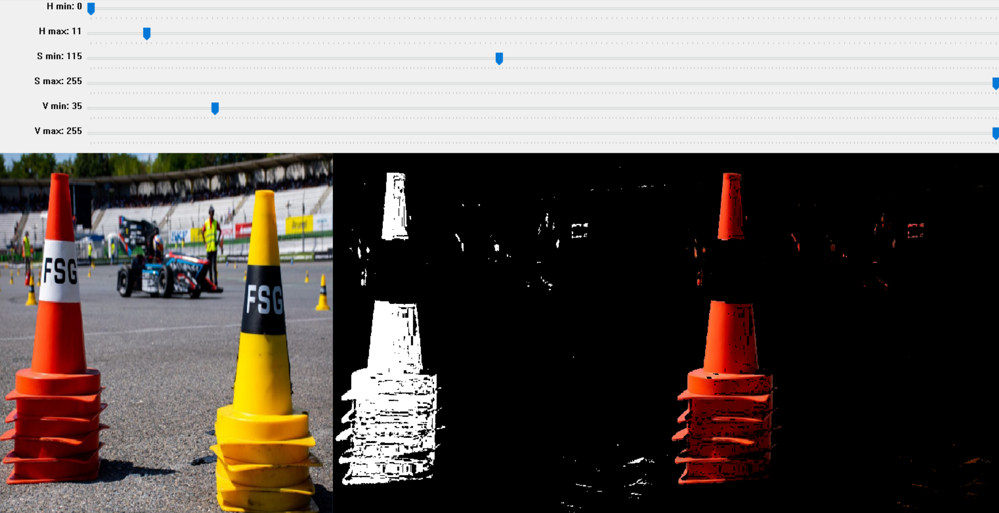
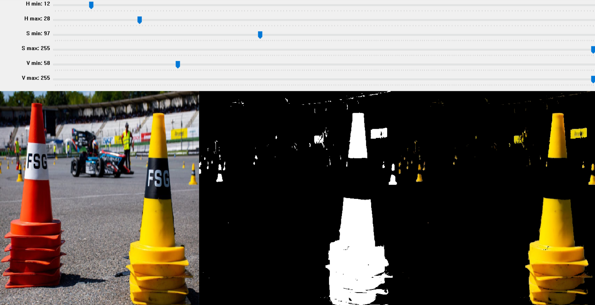

# FS Cone Perception Basics

Proyecto básico de detección de conos para Formula Student Driverless usando OpenCV.



*Fragmento de [Formula Student Germany Driverless Skidpad](https://www.youtube.com/watch?v=Fs6a0Aqu4YA) — KA-RaceIng e.V. Ver [Créditos](#créditos).*
## Descripción

Este repositorio contiene un pipeline sencillo de percepción que permite:

- Detectar formas que simulan conos en una imagen sintética
- Calcular el centroide de cada cono
- Generar Bounding Boxes 
- Filtrar ruido mediante operaciones morfológicas
- Clasificar conos por color en espacio HSV (azul, amarillo y naranja)
- Emparejar conos izquierdos y derechos para estimar el centro de la pista
- Detectar conos naranjas y amarillos en una foto real de competición
- Calibrar rangos HSV con trackbars sobre esa foto de competición
- **Detectar conos azules, amarillos y naranjas frame a frame en un vídeo real on-board**

El objetivo es construir una base sólida de visión por computador orientada a la detección de conos, que es uno de los primeros pasos en el stack de Autonomous de Formula Student.

## Archivos

- `cone_detection_basic.py` — detección por umbral, morfología, contornos y bounding boxes
- `cone_detection_hsv.py` — detección y etiquetado por color (HSV)
- `cone_track_centerline.py` — pares azul/amarillo y línea central de pista
- `cone_detection_real.py` — detección HSV sobre una foto real de pista
- `hsv_tuner.py` — sliders para ajustar H, S y V sobre la foto real
- `cone_detection_video.py` — detección de conos en vídeo real (cámara on-board)
## Detección en vídeo real

`cone_detection_video.py` procesa el vídeo frame a frame con este pipeline:

1. **Redimensionado**: si el frame supera los 900 px, se escala manteniendo la proporción.
2. **Máscara del cockpit**: como la cámara va fija al chasis, el morro del coche siempre ocupa la misma zona. Se define un polígono de 8 puntos (en coordenadas relativas) y se excluye de la detección para evitar falsos positivos.
3. **Segmentación HSV** por color (azul, amarillo y naranja) con `cv2.inRange`.
4. **Morfología**: cierre (×2) + apertura (×1) con kernel 5×5 para limpiar la máscara sin deformar los conos lejanos.
5. **Contornos y filtros geométricos**. Se descarta un contorno si:
   - su área es menor de 50 px²
   - la caja es demasiado pequeña (ancho < 6 px o alto < 10 px)
   - no es más alto que ancho (`h < 1.03·w`) o es demasiado alargado (`h > 4.2·w`)
   - ocupa más del 2 % del frame
   - su base está en el 54 % superior de la imagen (cielo, gradas, fondo)
   - toca los bordes laterales del frame
   - rellena menos del 33 % de su bounding box
6. **Filtro de forma**: se compara el ancho medio del tercio superior de la silueta con el del tercio inferior. Un cono es más estrecho arriba que abajo; si no se cumple, se descarta.
7. **Consistencia temporal**: una detección solo se dibuja si en el frame anterior había un cono del mismo color a menos de 25 px. Así se eliminan reflejos y brillos que aparecen en un único frame.

### Vídeo de entrada

El vídeo original **no se incluye** en el repositorio. Para reproducir el resultado:

1. Descarga un fragmento de ~11 s del vídeo [Formula Student Germany Driverless Skidpad](https://www.youtube.com/watch?v=Fs6a0Aqu4YA) de KA-RaceIng e.V. (fragmento usado: del `00:16` al `00:27`).
2. Guárdalo como `videos/track.MOV` en la raíz del repositorio.
3. Ejecuta el script desde la raíz del repo. Pulsa `q` para salir.

## Librerías utilizadas

- Python
- OpenCV
- NumPy
- Matplotlib

## Cómo ejecutarlo

1. Clonar el repositorio
2. Instalar las dependencias:
```bash
pip install -r requirements.txt
```
3. Ejecutar el script básico:
```bash
python cone_detection_basic.py
```
4. Ejecutar el script HSV:
```bash
python cone_detection_hsv.py
```
5. Ejecutar el script de centro de pista:
```bash
python cone_track_centerline.py
```
6. Ejecutar el script con foto real (ejecutar desde la raíz del repo):
```bash
python cone_detection_real.py
```
7. Ejecutar el script del calibrador HSV:
```bash
python hsv_tuner.py
```
8. Ejecutar la detección en vídeo (ver [Vídeo de entrada](#vídeo-de-entrada)):
```bash
python cone_detection_video.py
```
## Resultados

### Detección en vídeo real

Vídeo completo del resultado (~11 s):

https://github.com/user-attachments/assets/5662f1a0-3751-4e0a-a8d5-498579b583ac

Vista previa en GIF:


*Vídeo original: [Formula Student Germany Driverless Skidpad](https://www.youtube.com/watch?v=Fs6a0Aqu4YA) — KA-RaceIng e.V.*

### Imagen sintética y foto real











## Estado actual

- [x] Creación de imagen sintética con conos
- [x] Preprocesamiento (threshold + morfología)
- [x] Detección de contornos
- [x] Cálculo de centroides
- [x] Bounding Boxes (recto y orientado)
- [x] Clasificacion por color HSV en imagen sintética (azul/amarillo/naranja)
- [x] Estimación del centro de pista a partir de pares azul / amarillo
- [x] Detección por color (HSV) en imágenes reales
- [x] Calibración de rangos HSV con trackbars
- [x] Detección en vídeo real con máscara de cockpit, filtros geométricos y consistencia temporal
- [ ] Integración con ROS2

## Próximos pasos

- Probar el pipeline con más vídeos (otra luz, otras pistas)
- Sustituir la consistencia entre frames por un tracker (p. ej. asignación por IDs)
- Empezar a estructurar el código como nodos de ROS2

## Créditos

Las imágenes de vídeo usadas para probar `cone_detection_video.py` proceden de
[Formula Student Germany Driverless Skidpad](https://www.youtube.com/watch?v=Fs6a0Aqu4YA),
publicado por [KA-RaceIng e.V.](https://www.youtube.com/@KARaceIng) (KIT, Karlsruhe).
Todos los derechos del vídeo original pertenecen a sus autores. Se utiliza un fragmento
breve con fines exclusivamente educativos y no comerciales; el vídeo original no se
redistribuye en este repositorio.

---
Desarrollado como parte de mi preparación para entrar en el área de Autonomous de UVigo Motorsport.
